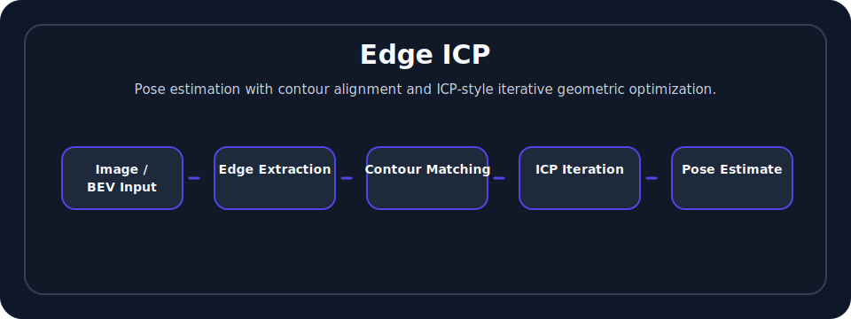
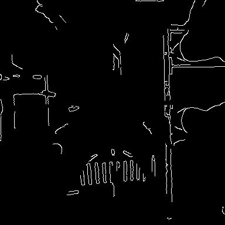
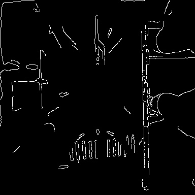
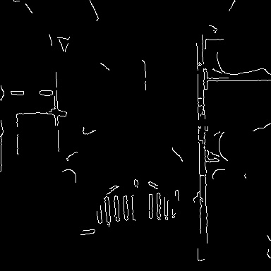

# Edge ICP

<p align="center">
  
  
  
  
</p>

[中文](#中文说明) | [English](#english)

## Contents

- [Overview](#english)
- [Visual overview](#visual-overview)
- [Example results](#example-results)
- [Build](#build)
- [Usage](#usage)
- [Repository structure](#repository-structure)
- [Related publication](#related-publication)
- [Citation](#citation)
- [License](#license)
- [中文说明](#中文说明)

## English

An experimental C++ project for pose estimation using **edge / contour alignment** and **ICP-style iterative optimization**.

The project explores whether image edges, BEV contours, road boundaries, and other geometric structures can provide useful constraints for localization.

## Motivation

Point-feature matching is not the only way to estimate motion. In driving and robotics scenes, contours such as lane markings, curbs, road boundaries, and object edges can also provide strong geometric information. Edge-based alignment can be useful when texture features are weak or unstable.

## Main ideas

- Convert BEV contour images into lightweight 2D point clouds.
- Align consecutive contour point clouds with ICP.
- Estimate frame-to-frame relative motion from geometric contour constraints.
- Keep a small runnable sample sequence for public demonstration and reproducibility.

## Visual overview

<p align="center">
  
</p>

## Example results

<p align="center">
  
  
  
</p>

The repository includes a compact 20-frame contour sequence under [`examples/contour_sequence`](examples/contour_sequence), enough to run a short pairwise ICP demonstration without keeping the original large experimental dump.

## Build

Dependencies:

- CMake >= 3.10
- C++11 compiler
- OpenCV
```bash
mkdir -p build
cd build
cmake ..
make -j
```

## Usage

Run the contour ICP demo on the bundled sample sequence:

```bash
./build/contour_icp examples/contour_sequence 5
```

Arguments:

```text
contour_icp <dataset_directory> [max_pairs]
```

The dataset directory should contain:

```text
associate.txt
contours/*.jpg
```

Each `associate.txt` line follows:

```text
timestamp odometry_x odometry_y odometry_yaw contour_image_name
```

## Repository structure

```text
.
├── assets/                    # README visual overview
├── examples/contour_sequence/ # 20-frame public sample sequence
├── src/contour_icp.cpp        # Main contour-to-point-cloud + ICP demo
├── CMakeLists.txt
├── CITATION.cff
├── LICENSE
├── NOTICE
└── README.md
```

## Keywords

`ICP`, `edge alignment`, `contour matching`, `pose estimation`, `visual localization`, `BEV`, `autonomous driving`, `OpenCV`, `C++`

## Related publication

This repository is an experimental extension inspired by the following paper:

- [**ViLiVO: Virtual LiDAR-Visual Odometry for an Autonomous Vehicle with a Multi-Camera System**](https://ieeexplore.ieee.org/document/8968484/)

It is **not** the original implementation of ViLiVO. The repository focuses on edge / contour based pose-estimation experiments that extend related geometric-localization ideas.

## Project status

This is an experimental repository. It has been cleaned into a small public-facing demo rather than a full research codebase.

## Citation

If you use this repository, please cite or acknowledge it using the metadata in [`CITATION.cff`](CITATION.cff).

## License

This repository is released under the [Apache License 2.0](LICENSE). Please retain the license and notice files when redistributing or reusing the code.

---

## 中文说明

这是一个基于 **C++** 的边缘 / 轮廓匹配实验项目，主要探索如何利用 **ICP 风格的迭代优化** 做位姿估计。

项目关注道路边界、车道线、物体轮廓、BEV 边缘等几何结构在视觉定位中的作用。当前版本已经整理为一个轻量 public demo：保留一个主程序和 20 帧示例轮廓序列，便于快速理解和运行。

## 构建与运行

```bash
mkdir -p build
cd build
cmake ..
make -j

./build/contour_icp examples/contour_sequence 5
```

## 关键词

ICP、边缘匹配、轮廓匹配、位姿估计、视觉定位、BEV、自动驾驶、OpenCV、C++。

## 相关论文

该仓库是受以下论文启发的实验性延伸：

- [**ViLiVO: Virtual LiDAR-Visual Odometry for an Autonomous Vehicle with a Multi-Camera System**](https://ieeexplore.ieee.org/document/8968484/)

需要注意：该仓库**不是** ViLiVO 的原始实现，而是围绕边缘 / 轮廓约束位姿估计做的延伸性实验。

## 引用与许可

如果你使用该仓库，请通过 [`CITATION.cff`](CITATION.cff) 引用或致谢该项目。许可协议见 [`LICENSE`](LICENSE)。
